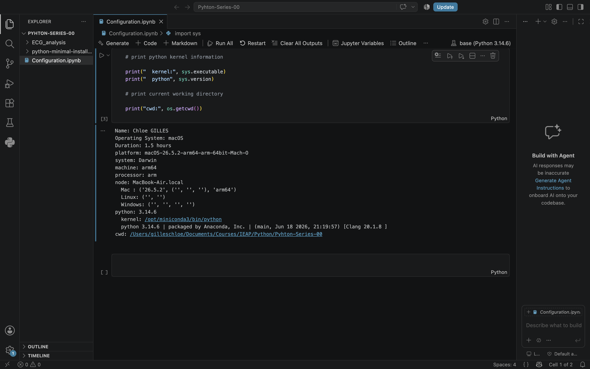

# Git-Series-00
This repository is used to learn the basics of Git and GitHub

## Introduction

This repository is where I'm learning the basics of Git and GitHub by doing (*learn-by-doing*), as part of my Master's program.

I'm not a complete beginner: I've had one course where GitHub was used, but only two sessions so far (two hours each), so my exposure is still quite limited. I'd like to build a more solid, hands-on understanding of how Git actually works under the hood (branches, commits, pushes) rather than just using GitHub passively.

I'm looking forward to learning more about Git and GitHub, especially to manage and share my future data analysis projects more effectively.

## A Nice Image

## My Motivation

I want to learn Python and R because they are essential tools in modern research and data analysis.
I am interested in using programming to analyse movement and health-related data.
Learning Git and GitHub will help me organise, track and share my projects more efficiently.
I am still a beginner, so I want to become more confident by learning through practice.
My goal is to build useful skills that I can apply to my future studies, research and career.

## My Python environment

Here is a screenshot of my Python environment:

## What I learned

I learned the basic concepts of Git and GitHub, including repositories, branches, commits and remote repositories.
I learned how to clone a repository, create a branch, make changes and track them locally.
I learned how to use GitHub Desktop to commit and push my changes to GitHub.
I learned how to use Markdown and relative paths to add local images, and that file names must match exactly, including capitalization.
The main Git commands I learned are clone, branch, add, commit and push.

Overall, it took me approximately 45 minutes to complete this assignment.
